<!-- YoRHa archive -->
<p align="center"></p>

A small Bash-like shell in C: tokenizer, syntax checker, pipes, redirections, heredocs, `&&` / `||` with parentheses, and wildcards.

## ▸ Overview
minishell reimplements the core of an interactive shell. Each input line is checked for syntax errors
(unclosed quotes, unbalanced parentheses, misplaced operators), split into tokens, expanded, then executed:
logical groups first (`&&`, `||`, `( )`), then pipelines of commands with their redirections.
The environment is kept in its own linked list so `export` / `unset` affect child processes.

## ▸ Features
- Prompt `minishell$ ` with readline history
- Single and double quotes; `$VAR` and `$?` expansion
- Pipes `|` and redirections `<`, `>`, `>>`, heredoc `<<`
- Logical operators `&&` and `||` with `( )` grouping
- `*` wildcard expansion against the current directory (hidden files skipped)
- Builtins: `echo [-n]`, `cd`, `pwd`, `env`, `export`, `unset`, `exit`
- Signals: `Ctrl-C` redraws the prompt, `Ctrl-\` ignored at the prompt, `Ctrl-D` exits
- Exit codes 126 / 127 for permission denied / command not found

## ▸ Usage
```bash
make && ./minishell
```
```text
minishell$ ls *.c | wc -l
minishell$ (false || echo retry) && echo "status: $?"
minishell$ cat << EOF > notes.txt
```
Requires GNU readline. The Makefile looks for it under `~/.brew` (42 macOS setup) and builds with `-fsanitize=address`;
`make leaks` runs the macOS `leaks` tool on exit.

## ▸ Structure
```text
verify_input*.c         syntax checks (quotes, parentheses, operator placement)
create_tokens.c         tokenizer
convert_env*.c          $VAR / $? expansion
logic.c                 && / || / ( ) evaluation
pipe*.c  commands*.c    pipelines, redirections, heredoc, execve
wildcards*.c            * expansion
builtin*.c  export_env* builtins and environment list
```

## ▸ Squad
- **dvandenb** — tokenizer, syntax checks, logical operators, command execution, builtins
- **alde-oli** (Alexandre) — wildcard expansion (`wildcards.c`), plus the first versions of variable expansion (`convert_env.c`), the export list (`export_env*.c`) and the pipe module (`pipe.c`), which dvandenb later edited

Authorship above is taken from the 42 file headers; the Git history is a single import commit.

---
<sub>▸ Archived by UNIT ALDE-OLI · [profile](https://github.com/alde-oli)</sub>
